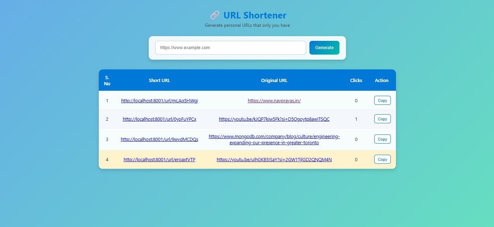
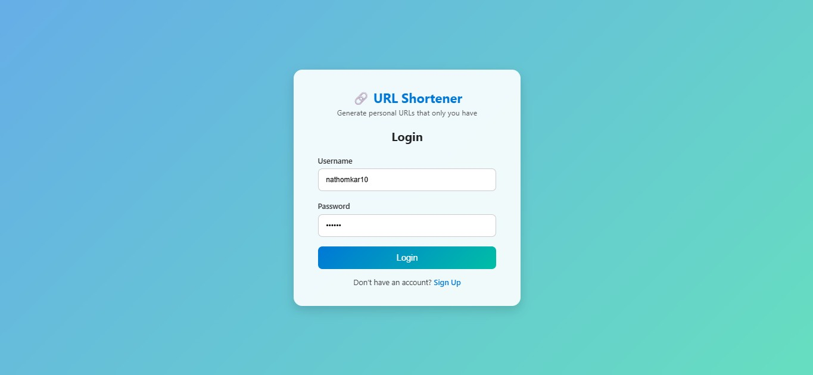
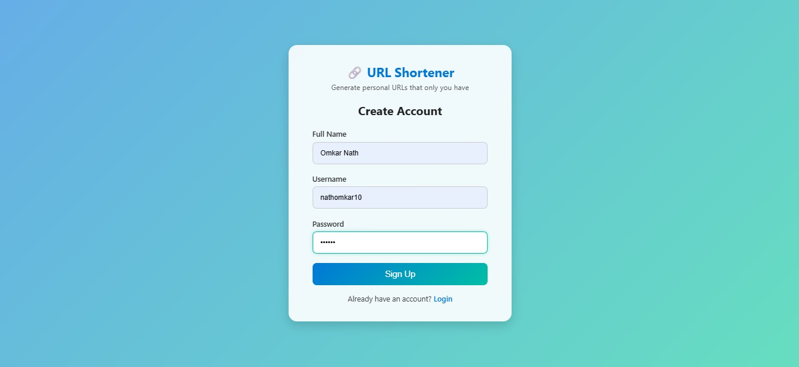

# 🔗 URL Shortener

A **modern and user-friendly URL shortener** built with **Node.js**, **Express.js**, and **MongoDB**.  
Easily generate short links for long URLs, track clicks, and share them effortlessly. Ideal for personal use or as a learning project for web developers.

---

## 🚀 Features

- Generate **short URLs** for any valid link.  
- Track the **number of clicks** (visit history).  
- **Copy URLs** with a single click and tooltip feedback.  
- Highlight the **latest generated URL** for easy visibility.  
- Supports **both logged-in and anonymous users**.  
- **Responsive and clean UI** built with HTML, CSS, and EJS templates.  

---

## 🖼️ Screenshots

**Home Page:**  
  
*Enter URLs and view generated short links.*

**Login Page:**  
  
*Login using your username and password.*

**Signup Page:**  
  
*Quick registration with name, username, and password.*

---

## 🛠️ Tech Stack

- **Backend:** Node.js, Express.js  
- **Database:** MongoDB (Atlas or local)  
- **Templating Engine:** EJS  
- **Frontend:** HTML, CSS, JavaScript  
- **Session Management:** In-memory map (for demo purposes)  

---
